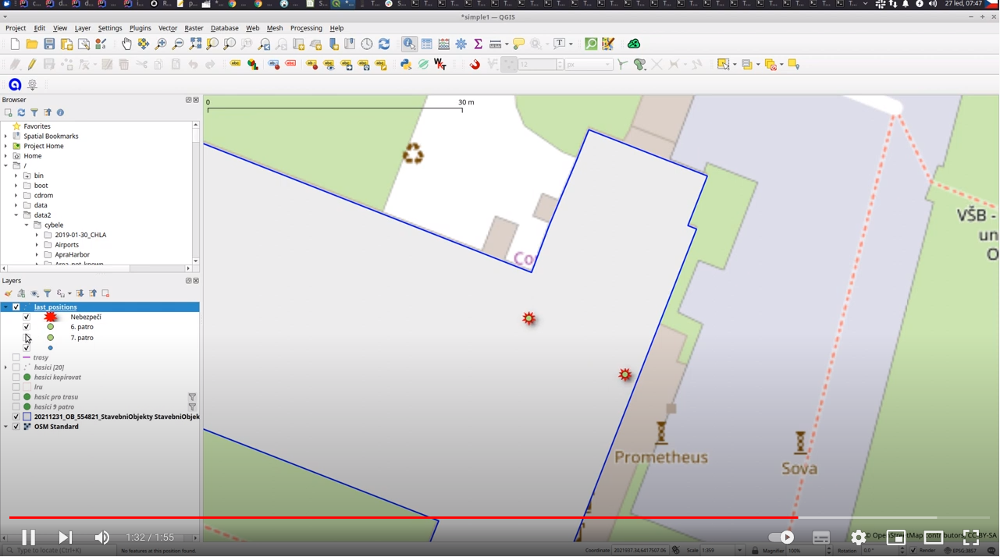

# IZS

Repo is for testing basic concepts of visualisation monitoring movement of fireman inside building.

## Prepare

The simulation is based on existing data in PostGIS database. There is sample dum in [db/izs.dump.gz](db/izs.dump.gz).

Newly there is a version based on GPKG, so you do not need to install and configure PostGIS.
You need to only edit [simulation/gpkg_simulation.py](simulation/gpkg_simulation.py) and set correct
paths to [db/izs.gpkg](db/izs.gpkg).

You must run simulation in QGIS in project [db/simulation.qgz](db/simulation.qgz)
The simulation is using QThread that is imported into QGIS environment.
To stop the simulation you have to create file specified in [simulation/gpkg_simulation.py](simulation/gpkg_simulation.py)
otherwise the simulation stops after 5 * 418 seconds.

## Simulation

For purposes of communication with a customer there is simulation based on two created tracks 
inside building A of VSB-TUO. 

How it works:
* We have track separated into about 400 points
* In a loop, we read point and insert it into positions database
* We do this 4 times with a little different configuration (we start on different position and floor)

Run simulation:

```bash
python3 postgis_simulation.py
```

```bash
python3 gpkg_simulation.py
```

See the video (Normal situation - two floors)
[](https://youtu.be/mTJI8IyWP0Y)

See the video (High temperature on 6th floor)
[](https://youtu.be/8b6n3aEB-aU)

