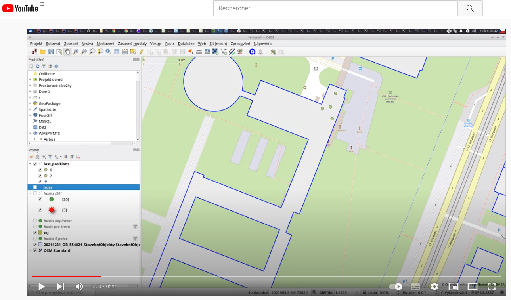

# IZS

Repo is for testing basic concepts of visualisation monitoring movement of fireman inside building.

## simulation

For purposes of communication with a customer there is simulation based on two created tracks 
inside building A of VSB-TUO. 

How it works:
* We have track separated into about 400 points
* In a loop, we read point and insert it into positions database
* We do this 4 times with a little different configuration (we start on different position and floor)

Run simulation:

```bash
python3 start_simulation.py
```

See the video
[](https://youtu.be/mTJI8IyWP0Y)
